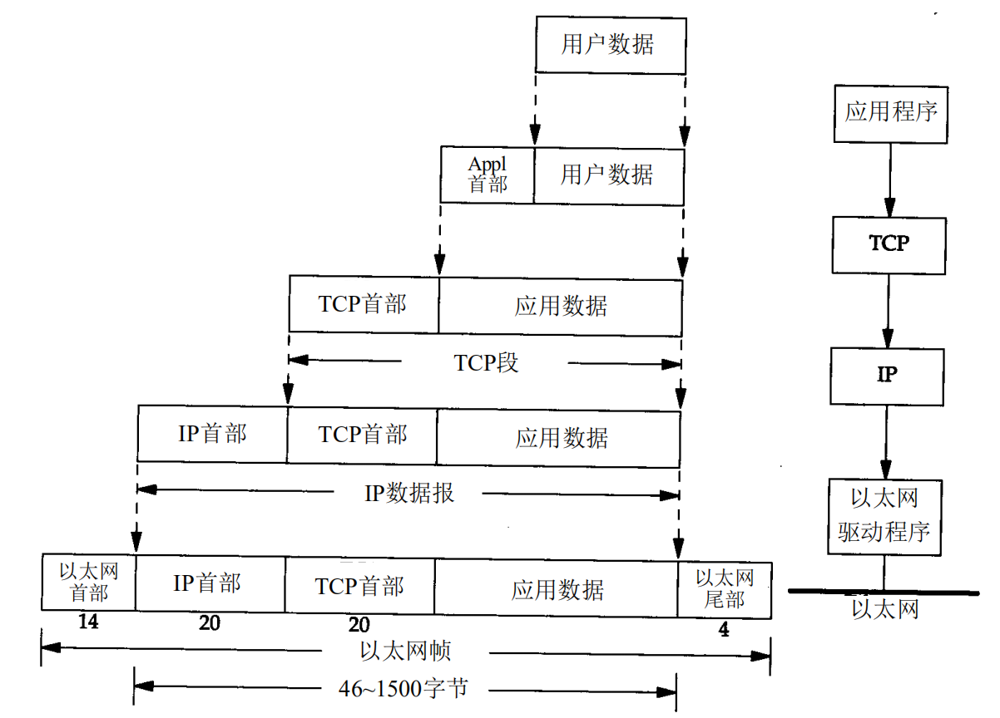

# 概述

## 计算机网络体系结构

计算机网络中常见的体系结构如下图:

* TCP/IP体系结构 :
  * 应用层(报文,message) : 应用层直接为用户的应用进程提供服务.主要的应用层协议有 : FTP,DNS,HTTP等.
  * 运输层(报文段,segment ) : 运输层负责向两个主机中进程之间的通信提供服务.
  * 网络层(数据报,datagram) : 网络层处理分组在网络中的活动,负责为分组交换网上的源主机到目的主机之间提供通信以及路由服务.在发送数据时,网络层把运输层产生的报文段或用户数据报封装成分组.同时,网络层的另一个任务是选择合适的路由,使源主机发送的数据,能够通过网络中的节点(路由器)找到目标主机.
  * 链路层(帧/分组,frame) : 有时也称作数据链路层或网络接口层,通常包括操作系统中的设备驱动程序和计算机中对应的网络接口卡.它们一起处理与电缆(（)或其他任何传输媒介)的物理接口细节.
* 五层体系结构 : 实际教学中使用该体系结构较多.TCP/IP体系结构和五层体系结构定义不同之处 : TCP/IP体系结构将数据链路层与物理层统称为链路层.
  * 数据链路层 : 在两个相邻结点之间(主机 路由器 交换机 集线器等之间)传送数据时,数据链路层将网络层提交下来的IP数据报组装成帧,在两个相邻结点的链路上传送帧中的数据.
  * 物理层 : 物理媒介的定义,包括双绞线,光纤等.bit流如何传输,接口(物理)定义等.
* OSI七层体系结构 : 由国际标准化组织制定的标准,它概念清楚,理论完善,但是复杂又不实用.在五层基础上将应用层进一步细化为 应用层 表示层 会话层.

## 分层

分层的核心是封装,发送时底层负责将上一层的数据添加上本层的数据头封装.接收数据底层负责解析数据拆掉本层的数据头,然后将封装的内容提供给上一层.

分层的好处 :

1. 各层之间是独立的.某一层不需要知道它的下一层如何实现,只需调用层间的接口即可.
2. 灵活性好.改变其中任一层,只要接口保持不变,则其他层不会受到影响.
3. 易于实现和维护.
4. 能促进标准化工作.每一层的功能有了精确的说明.

## RFC

计算机网络协议发布是通过 Request For Comments(RFC) 形式发布的.例如 [rfc114](http://www.rfcreader.com/#rfc114) 定义了 A FILE TRANSFER PROTOCOL 即 FTP.