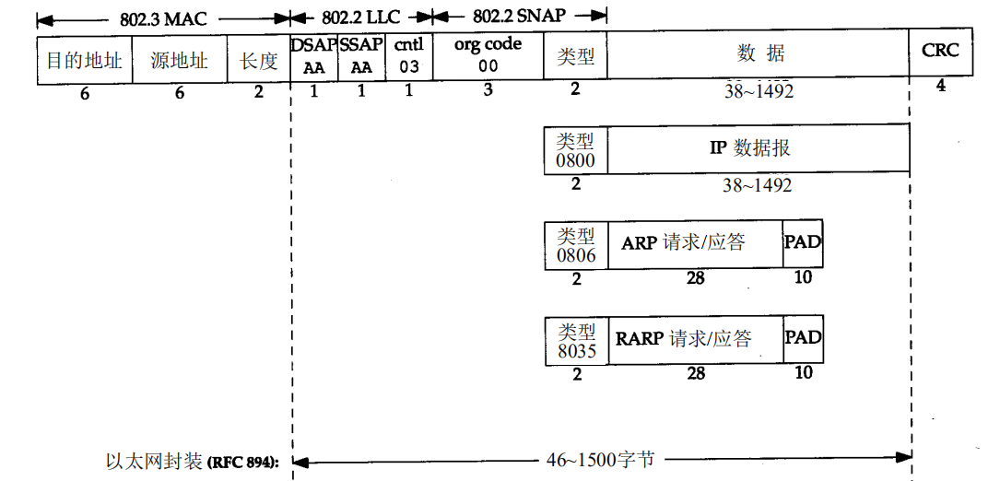

# 链路层

链路层提供的功能有:

1. 成帧(*framing*) : 为IP模块发送和接收IP数据报
2. 接入与传输 : 定义了多种接入方式,例如以太网 点对点 令牌环等,同时 MAC 协议定义了帧如何在链路上传输
3. 差错检测和纠正

链路层主体部分在网络适配器(网络接口卡 NIC)中实现.

## 差错检测和纠正

### 奇偶校验

* 简单奇偶校验 : 增加一个bit位,控制这个bit位,使得数据中1的个数为奇数/偶数
* 二维奇偶校验 : 行列奇偶

### 检验和

将数据作为k bit(一般为16)位整数计算和.

### CRC

循环冗余校验 :

1. 商定一个 r + 1 位的 G
2. 传输数据 D
3. 计算 r 位CRC比特 R 附加到 D 后面,使得 (D * 2 ^ r + R) 可以被G整除

## 接入

链路层接入形式可以简单概括为两种 : 点对点和广播(即多对多).点对点比较简单只需要关心源和目的节点,广播则需要考虑多路访问发送数据冲突的问题.

### 点对点

* SLIP : 全称是 Serial Line IP. 它是一种在串行线路上对IP 数据报进行封装的简单形式
* PPP : 点对点修改了 SLIP 协议中的所有缺陷

### 广播

#### 多路访问

可能有多个节点接入到链路中,如何保证节点发送数据不会互相冲突.

* 信道划分协议 : 链路复用技术 比如 TDM(时分多路复用) FDM(频分多路复用) CDMA(码分多址,多用于无线移动网络)
* 随机接入协议 :
  * 时隙ALOHA
  * **CSMA**(载波侦听多路访问) : 侦听 -> 空闲发送
  * **CSMA/CD**(带冲突检测的载波侦听多路访问) : 侦听 -> 空闲发送 -> 被干扰停止发送
* 轮流协议 : 轮询协议(主节点轮询) 令牌传递(持有令牌才能传输)

## 交换局域网

### MAC 地址

MAC 地址长度为6个字节,接入设备都需要有固定的MAC地址(虽然可以修改).

FF-FF-FF-FF-FF-FF 为MAC广播地址.

### 以太网

以太网是非常常见的链路层接入方式,通过一系列标准将多个节点使用星型拓扑连接起来.其数据封装形式如下 :

> 从集线器到交换机 : 最开始以太网是通过设备连接到集线器上形成星型结构
> 集线器以太网需要使用冲突检测发送数据
> 而后来逐步被交换机所取代 交换机虽然也是星型结构 但是端口之间输全双工且互相隔离的 因此是无冲突的

交换机转发数据 首先查询交换表中是否存在对应的目的地址,然后再通过广播形式向所有端口广播该帧,其他交换机or主机接收到后根据自己交换机表或者MAC地址选择转发,接收或者丢弃.

以太网发送数据需要8个字节的前同步码 101010101 * 7 + 101010111,用于唤醒同步设备

### 虚拟局域网VLAN

交换机允许对一个物理局域网定义多个虚拟局域网以对广播等进行隔离.

## 其他一些补充

* IEEE 802 协议族定义了关于链路层的很多标准.包括 以太网 令牌环 无线网等