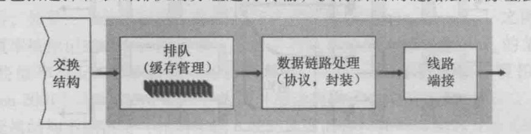

# 网络层

该章节首先会介绍网络层的一些基本概念,然后介绍以下内容:

* [IP](./ip.md) : 网络层编址
* [ARP](./arp.md) : 地址解析协议,即 **Address Resolution Protocol** 根据IP地址获取物理地址的一个协议
* [RARP](./rarp.md) : 逆地址解析协议,功能和ARP协议相对,其将局域网中某个主机的物理地址转换为IP地址
* [ICMP](./icmp.md) : Internet 控制报文协议
* [IGMP与多播](./igmp.md) : Internet 组管理协议
* [路由选择协议](./route.md) :
  * RIP协议 ：贝尔曼福特算法,跳数作为路由的度量标准(*metric*),最大跳数15,如果大于15,它就会丢弃数据包
  * OSPF协议 ：Open Shortest Path First(开放式最短路径优先),迪杰斯特拉算法
  * IS-IS
  * BGP

网络层有两个重要功能 : 分组和转发,这是通过三层设备 : 路由器完成的,路由器中维护了一张转发表,用来确定三层数据 : 数据报, 该发往哪一个下一节点.除了上述两个功能,网络层在需要时,还会提供连接建立功能.

网络层提供面向连接的虚电路网络(帧中继 ATM)和无连接的数据报网络(因特网)

## 虚电路 : 电路交换

分为建立 传输 和拆除三个阶段,涉及到的数据称为信令报文.

不同于运输层TCP的面向连接,虚电路网络建立需要路径上所有路由器参与并且路由器知晓这条虚电路的存在.而TCP面向连接仅涉及到源和目的两个端系统,所有内容比如序号流量控制端口等由这两个端系统维护.

## 数据报网络 : 分组交换

数据报网络将数据报送入网络层,由网络中的路由器等系统负责转发这些数据报.

## 路由器工作原理

### 输入输出端口

一般成对出现,接收发送数据

输入端口负责接收 拆包 查找路由 排队 发送到交换结构

输出端口负责接收交换结构数据 封包 发送

### 交换结构

将所有输入输出端口相联,负责端口->端口的数据交换,下图是三种交换技术

### 路由选择处理器

更新路由表