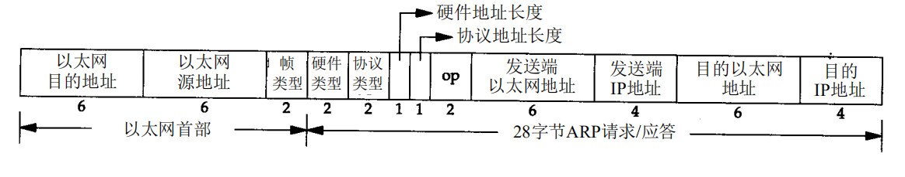

# ARP

## ARP帧

ARP用来将IP翻译成以太网48位地址(MAC地址),当需要查询或者应答时,需要发送一个ARP帧,其格式如下 :

协议类型 0x8006

其中操作字段 : ARP请求(值为1),ARP应答(值为2),RARP请求(值为3)和RARP应答(值为4)

ARP请求是广播的,但是ARP应答时直接发送到请求主机的.

本地都会有ARP缓存,并且设置过期时间,当查询不到才会发送ARP请求.

## ARP代理

在没有配置默认网关的网络上,可以通过路由器ARP代理,是网络上的主机访问另一个网络上的主机.需要在执行代理的路由器上进行设置.