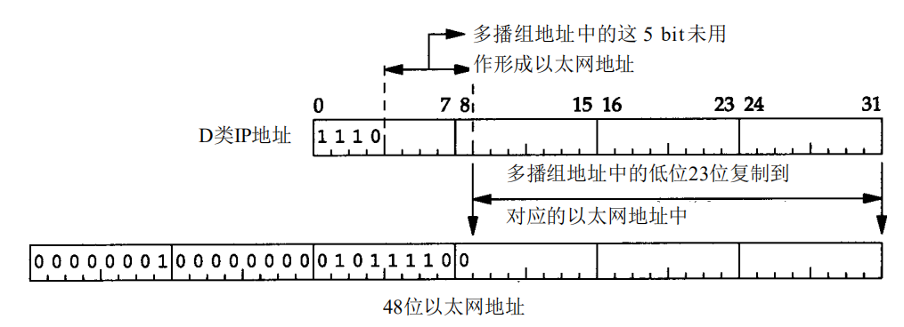
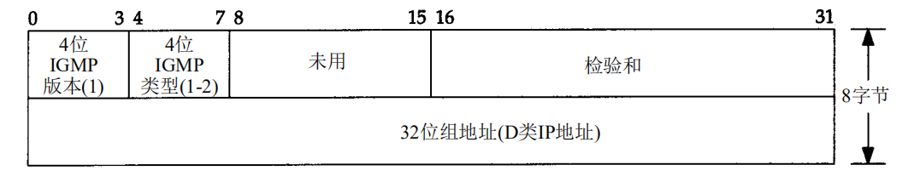

# IGMP

在介绍IGMP之前,首先了解下广播与多播.这里的多播和广播指的是网络层的,并且仅被UDP使用,TCP是点对点的.

## 广播

主机号全为1的地址为广播地址,例如 255.255.255.255 或者 A 类地址的 netid.255.255.255

## 多播

多播主要使用于两个场景 :

1. 向多个目的地址传送数据
2. 客户对服务器的请求

D类地址 224.0.0.0 到 239.255.255.255  用于多播,一些多播组地址被 IANA 确定为知名地址,例如 224.0.0.1 代表该子网内的所有系统组,  224.0.0.2 代表该子网内所有路由器组 ,224.0.1.1 用于网络时间协议NTP

## IGMP协议

IGMP用于局域网多播,它让一个物理网络上的所有系统知道主机当前所在的多播组.多播路由器需要这些信息以便知道多播数据报应该向哪些接口转发.与ICMP一样也是通过放在IP数据报中发送,其数据格式如下:

