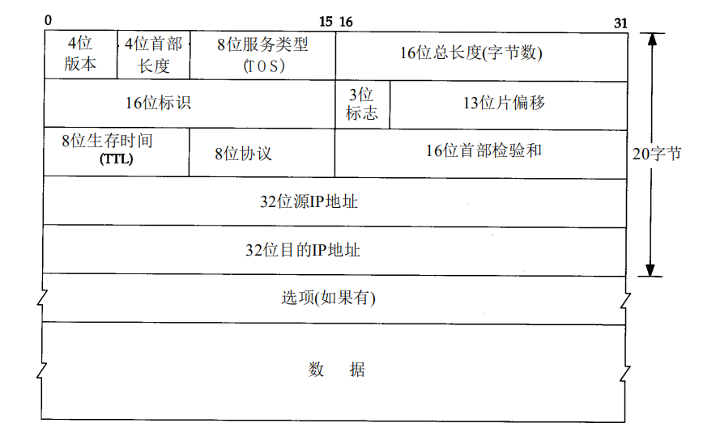
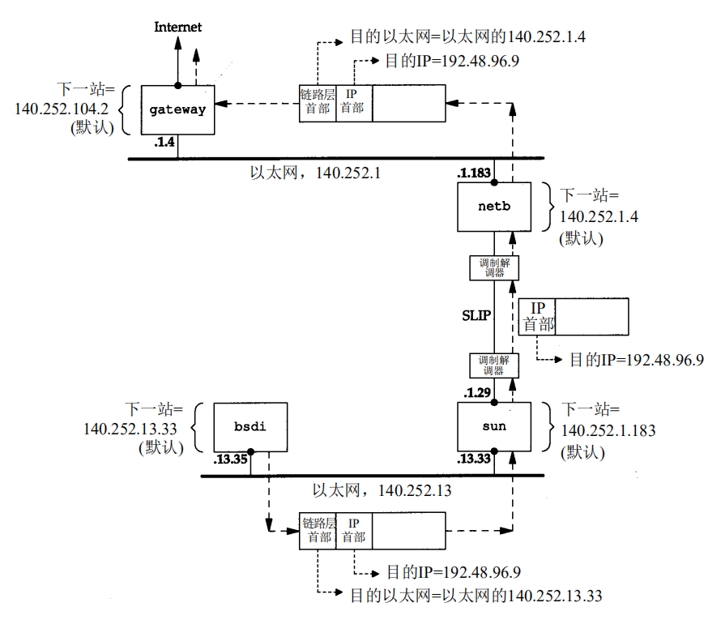

# IP

IP数据报是以Big Endian(大端,网络字节序)形式发送的.

> 数据报分片
>> 数据报通过链路层封装时,由于不同链路层定义了不同的MTU(最大传输单元),MTU大小可能小于数据报大小,因此可能会将数据报分成几部分,称为分片.分片可以发生在原始发送端主机上,也可以发生在中间路由器上.把一份数据报分片以后,只有到达目的地才进行重新组装.

## IPv4编址

IPv4编址是使用4字节的点分十进制记法表示的,例如 : `193.32.216.9` , 二进制表示为 : `11000001 00100000 11011000 00001001`

## 子网

### 分类编址

地址分为 A(`1.0.0.1—126.255.255.254`) B(`128.0.0.1—191.255.255.254`) C(`192.0.0.1—223.255.255.254`) 类,分别使用 1 2 3 个字节作为网络号

### CIDR

a.b.c.d/x ,例如 193.32.216.9/21,可以划分子网,也可以将几个A,B or C聚合成一个超网.更加灵活.

## 特殊地址

* 127.0.0.0-127.255.255.255
* 10.0.0.0-10.255.255.255
* 172.16.0.0—172.31.255.255
* 192.168.0.0-192.168.255.255

## 公网IP路由

主机bsdi有一份IP数据报要传到ftp.uu.net主机上 它的IP地址是192.48.96.9 :

1. 主机bsdi搜索路由表,没有找到192.48.96.9的路由条目,因此将数据包发送到默认路由上即sun.
2. 数据包填写目标IP地址为192.48.96.9,然后链路层封装数据包,使用sun的mac作为目标地址
3. sun收到帧发现是发给自己的,然后拆包,发现IP不是自己,需要转发到net,通过SLIP链路层(不是以太网链路)封装成帧,发送.
4. 同样net继续转发...最终到达ftp.uu.net

## NAT

当在专用网内部的一些主机本来已经分配到了本地IP地址(即仅在本专用网内使用的专用地址),但现在又想和因特网上的主机通信可使用NAT方法,过程如下:

1. client的gateway设定为NAT主机当要连Internet的时数据报被送到NAT主机,头部source IP为192.168.1.100(私有IP)
2. NAT主机将source IP修改为NAT主机的公网IP,发送到目标主机
3. 目标主机响应到达NAT主机,数据报dest IP为NAT主机的公网IP,通过将 dest IP修改为192.168.1.100,发送到client