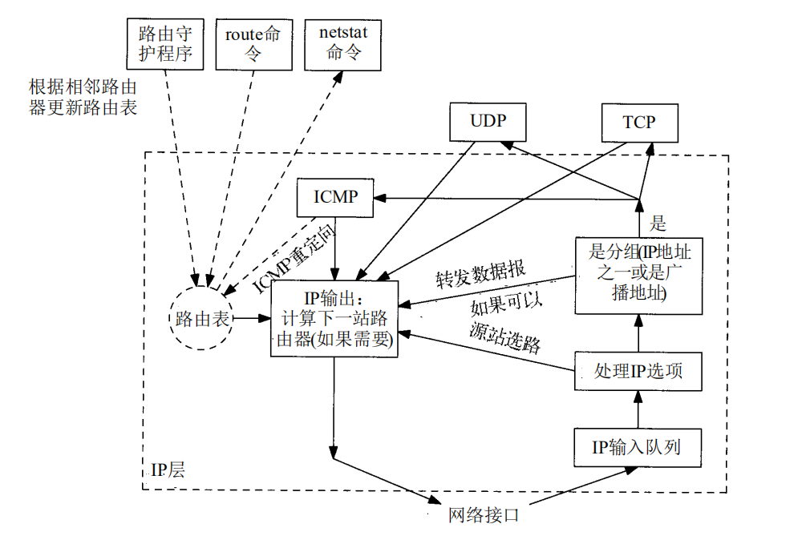
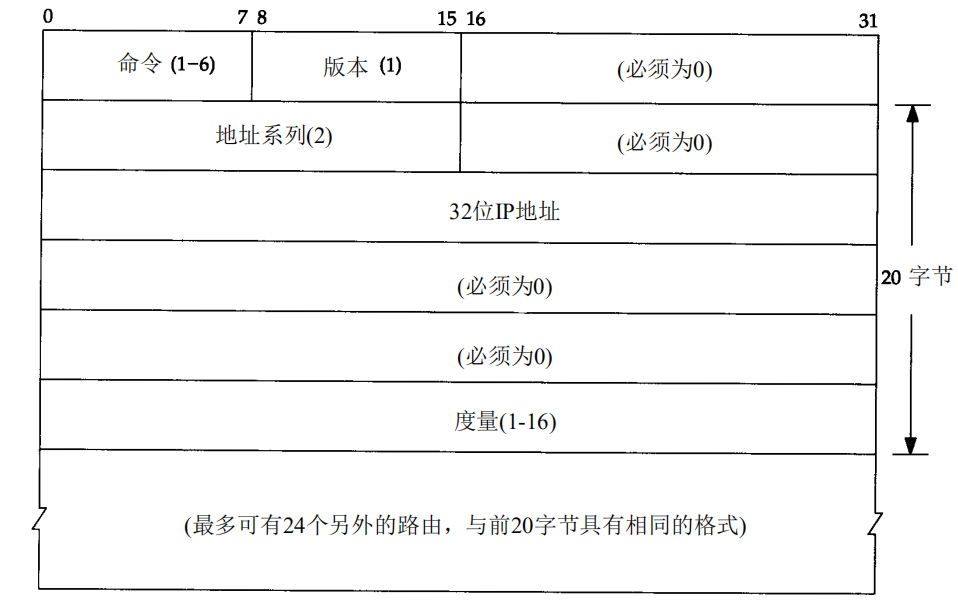

# 路由选择协议

网络层一个很重要的工作是路由选择,即如何从源系统选择路径前往目标系统.



路由表中维护了到达某个IP的路径选择信息,其实就是是下一跳目标信息,多数情况下,下一跳都不是目标,可能是路由器等.

## 静态路由

系统中可以通过route 命令指定路由信息

```shell
[root@localhost ~]# route
Kernel IP routing table
Destination     Gateway         Genmask         Flags Metric Ref    Use Iface
112.124.12.0    *               255.255.252.0   U     0      0        0 eth1
10.160.0.0      *               255.255.240.0   U     0      0        0 eth0
192.168.0.0     10.160.15.247   255.255.0.0     UG    0      0        0 eth0
172.16.0.0      10.160.15.247   255.240.0.0     UG    0      0        0 eth0
10.0.0.0        10.160.15.247   255.0.0.0       UG    0      0        0 eth0
default         112.124.15.247  0.0.0.0         UG    0      0        0 eth1

# 添加网关/设置网关：
route add -net 224.0.0.0 netmask 240.0.0.0 dev eth0    #增加一条到达244.0.0.0的路由。
#屏蔽一条路由：
route add -net 224.0.0.0 netmask 240.0.0.0 reject     #增加一条屏蔽的路由，目的地址为224.x.x.x将被拒绝。
#删除路由记录：
route del -net 224.0.0.0 netmask 240.0.0.0
route del -net 224.0.0.0 netmask 240.0.0.0 reject
#删除和添加设置默认网关：
route del default gw 192.168.120.240
route add default gw 192.168.120.240
```

## 动态路由

路由器中有很多动态学习路由信息的协议,下面进行简单介绍:

### RIP

RIP 报文封装在UDP报文段中,使用UDP端口`520`,格式如下 :



RIP 所使用的度量是以跳(hip)为单位的.

* 初始化 : 路由器进程启动后首先会发送请求,要求其他路由器发送完整路由表
* 接收到请求 : 响应,发送当前路由器维护的路由的信息
* 接收到响应 : 邻接路由器基础上跳数加一,更新路由表
* 定期选路更新 : 所有或部分路由器会将其完整路由表发送给相邻路由器
* 触发更新 : 每当一条路由的度量发生变化时更新并发送

不支持子网,某个节点出现故障后,收敛慢,容易路由环路.

### RIPv2

在RIP基础上扩充,支持子网,支持多播.

### OSPF

OSPF不使用跳数作为度量单位,是一个链路状态协议,每个路由器主动地测试与其邻站相连链路的状态,将这些信息发送给它的其他邻站,而邻站将这些信息在
自治系统中传播出去.OSPF直接使用数据报,而不是通过UDP或者TCP.

### BGP

BGP一种不同自治系统的路由器之间进行通信的外部网关协议,BGP系统与其他BGP系统之间交换网络可到达信息,将一个自治系统中的数据报分成本地流量和通过流量,本地流量是起始或终止于该自治系统的流量