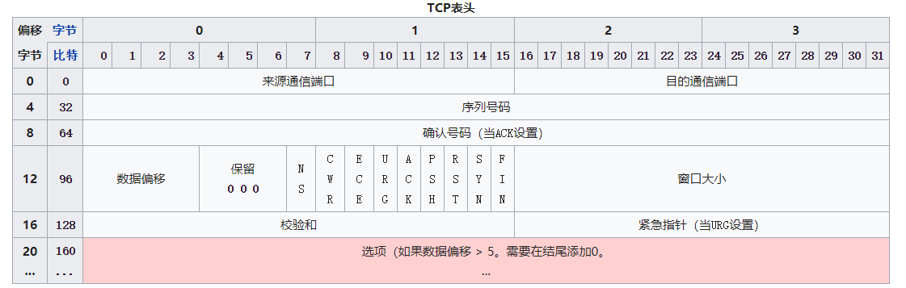

# TCP

TCP 是面向可靠连接的运输层协议.下面的应用层协议都通过使用TCP 实现 :

* HTTP协议
* FTP协议
* SMTP协议
* TELNET协议

TCP 协议头部如图,至少有20个字节构成 :

## 建立连接

## 释放连接

## 数据传输

### 滑动窗口协议

### 可靠传输

### 校验和

### 流量控制

流量控制用来避免主机分组发送得过快而使接收方来不及完全收下，一般由接收方通告给发送方进行调控。

### 拥塞控制

拥塞控制是发送方根据网络的承载情况控制分组的发送量，以获取高性能又能避免拥塞崩溃（congestion collapse，网络性能下降几个数量级）。这在网络流之间产生近似最大最小公平分配。