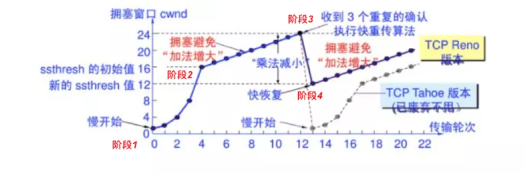

# TCP

TCP 是面向可靠连接的运输层协议.下面的应用层协议都通过使用TCP 实现 :

* HTTP协议
* FTP协议
* SMTP协议
* TELNET协议

TCP 协议头部如图,至少有20个字节构成 :

## 建立连接

TCP 建立连接是通过三次握手完成的:

建立连接过程如下:

* 最开始 客户端和服务器都处于 `CLOSED` 状态
* 第一次握手 客户端向服务器发送连接请求报文段
  * SYN = 1 seq = x(随机序列号) 并且不携带任何数据
  * 发送报文段后,客户端进入 `SYN_SEND` 状态
* 第二次握手 服务端接收到客户端的连接请求报文段,向客户端发送连接确认&请求报文段
  * SYN = 1 ACK = 1 seq = y(随机序列号) ack = x + 1 并且不携带任何数据
  * 发送报文段后,服务端进入 `SYN_RCVD` 状态
* 第三次握手 客户端接收到服务端的连接确认&请求报文段,向服务端发送连接确认报文段
  * ACK = 1 seq = x + 1(随机序列号) ack = y + 1 并且可以携带数据
  * 发送报文段后,客户端进入 `ESTABLISHED` 状态
  * 接收报文段后,服务端进入 `ESTABLISHED` 状态
* 进入 `ESTABLISHED` 状态后,就可以开始发送数据了

> SYN洪泛攻击:
>
> 从上可看出:服务端的TCP资源分配时刻 在完成第二次握手时就开始了,而客户端的TCP资源分配时刻在完成第三次握手时,这就使得服务器易于受到SYN洪泛攻击: 即同时多个客户端发起连接请求从而需进行多个请求的TCP连接资源分配

## 释放连接

释放连接称为四次挥手:

四次挥手释放连接过程如下:

* 客户端和服务端都处于`ESTABLISHED` 状态,双向发送数据.
* 第一次挥手 客户端向服务端发送连接释放报文段
  * FIN = 1 seq = u(上一个报文段序列号 + 1) 可以携带数据
  * 发送报文段后,客户端进入 `FIN-WAIT-1` 状态
* 第二次挥手 服务端收到客户端的连接释放报文段,向客户端发送连接释放确认报文段
  * ACK = 1 seq = v(上一个报文段序列号 + 1) ack = u + 1 可以携带数据
  * 发送连接释放确认报文段后,服务端进入 `CLOSE-WAIT` 状态
  * 接收连接释放确认报文段后,客户端进入 `FIN-WAIT-2` 状态,等待服务端发送释放连接请求

到此为止,客户端到服务端的TCP连接已经断开,TCP连接实际变成了单向的,服务端依旧可以向客户端发送数据,直到服务端断开连接:

* 第三次挥手 服务端向客户端发送释放连接报文段
  * FIN = 1 ACK = 1 seq = w(上一个报文段序列号 + 1) ack = u + 1 可以携带数据
  * 发送报文段后,服务端进入 `LAST-ACK` 状态
* 第四次挥手 客户端收到服务端的连接释放报文段,向服务端发送连接释放确认报文段
  * ACK = 1 seq = u + 1 ack = w + 1 可以携带数据
  * 发送连接释放确认报文段后,客户端进入 `TIME-WAIT` 状态,等待 2MSL (*Maximum Segment Lifetime*,最长报文段寿命) 后 客户端进入 `CLOSED`状态
  * 接收连接释放确认报文段后,服务端进入 `CLOSED` 状态

### 异常释放

正常情况下,通过四次挥手释放连接,但是在某些异常情况下

## 数据传输

相对于 UDP ,TCP 提供的是无差错的数据传输.

### 滑动窗口

* 发送窗口: 发送方用于控制哪些报文段可以被发送,哪些已经发送,哪些已经被接受.

1. 每收到一个确认报文段,发送窗口就向前滑动一个报文段的距离
2. 当发送窗口内无可发送的报文段时(即窗口内的报文段全部是已发送但未收到确认的报文段),发送方就会停止发送,直到收到接收方发送的确认报文段使窗口移动,窗口内有可以发送的报文段,之后才开始继续发送

* 接收窗口

用于控制可以接收哪些数据,当收到报文段后将窗口向前移动一个位置,并发回确认报文段,若收到的报文段落在接收窗口之外,则一律丢弃。

### 可靠传输

可靠传输通过滑动窗口和自动重传请求(ARQ)机制实现.发送的数据必须被接收方一一确认才算传输成功,如果没有被确认并且超时,则会超时重传.

#### 超时重传

首先重传的前提是超时,TCP 会选择在某个时间进行一次 `SampleRTT` 测试,计算得到 `EstimatedRTT` 以及 `DevRTT` (具体计算逻参考对应的 RFC),然后超时时间为

`TimeoutInterval = EstimatedRTT + 4 * DevRTT`

超过这一个时间就会选择重传.

#### 校验和

重传的另一个前提对方收到的数据有误,会通过校验和对数据进行校验

TCP的16位的校验和(checksum)的计算和检验过程如下: 发送者将TCP报文段的头部和数据部分的和计算出来,再对其求反码,就得到了校验和,然后将结果装入报文中传输.

#### 自动重传请求

当传输出现差错时,即发送的报文段没有按时收到确认报文,会通过自动重传请求协议对报文段进行重传.

* 停等式ARQ : 发送窗口大小 = 1 接收窗口大小 = 1
* 连续ARQ : 发送窗口大小 > 1 接收窗口大小 = 1,多滑动窗口 + 累计确认 + 后退N帧 + 超时重传
* 选择重传ARQ : 发送窗口大小 > 1 接收窗口大小 > 1

### 流量控制

流量控制用来避免主机分组发送得过快而使接收方来不及完全收下,一般由接收方通告给发送方进行调控.

### 拥塞控制

拥塞控制是发送方根据网络的承载情况控制分组的发送量,以获取高性能又能避免拥塞崩溃(*congestion collapse*,网络性能下降几个数量级).这在网络流之间产生近似最大最小公平分配.

拥塞窗口 : 发送方维持一个根究自己估算的网络状况计算的状态变量: 拥塞窗口(cwnd,congestion window)
  
#### 慢开始与拥塞避免

* 慢开始 : 拥塞窗口数值每次乘以2
* 拥塞避免 : 拥塞避免阶段 拥塞窗口每次增加1

先设置一个 ssthresh,慢开始 ----拥塞窗口 == ssthresh---> 拥塞避免 ----拥塞----> ssthresh = 拥塞窗口/2 ----> 慢开始

#### 快重传与快恢复

* 快重传 : 接收方每收到一个失序的报文段后就立即发出重复确认(例如丢失了 M3 ,收到 M4 M5 M6 都会发送M2的重复确认),发送方只要一连收到3个重复确认就立即重传对方尚未收到的报文段
* 快恢复 : 出现快重传,需要设置拥塞窗口与ssthresh 然后重新执行拥塞避免算法.

