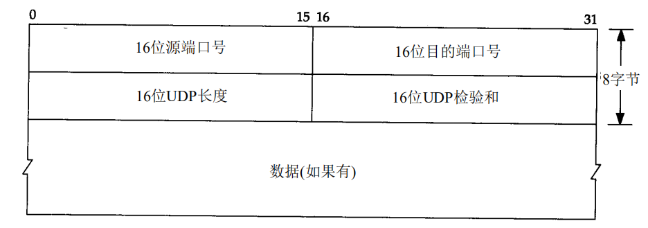
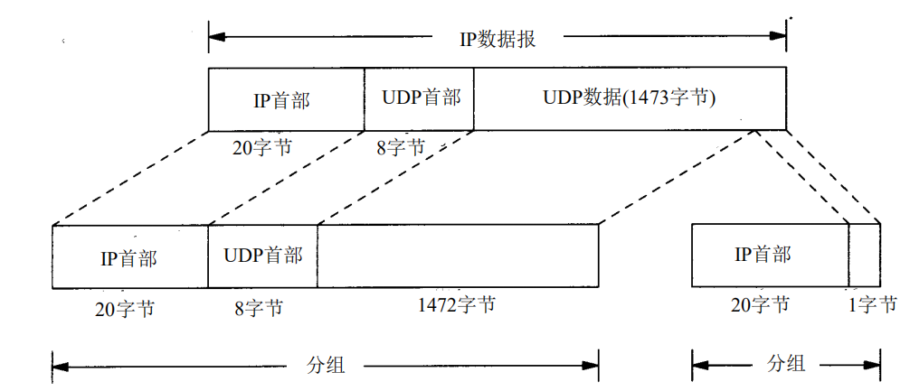

# UDP

UDP 报文段结构如下图:

## IP分片

之前提到过物理网络层一般要限制每次发送数据帧的最大长度,IP层将MTU与数据报长度进行比较,如果需要则分片,重新组装由目的端的IP层来完成.

当发生分片时,如果任意一个数据报丢失导致报文段不完整,则会导致整个报文段重传,网络层并没有重传的机制.

## 端口

TCP和UDP 都有端口这一概念,用来表示不同的系统进程.

* 公认端口(WellKnownPorts) : 从0到1023,它们紧密绑定(*binding*)于一些服务.通常这些端口的通讯明确表明了某种服务的协议.例如:80端口实际上总是HTTP通讯.
* 注册端口(RegisteredPorts) : 从1024到49151.它们松散地绑定于一些服务.也就是说有许多服务绑定于这些端口,这些端口同样用于许多其它目的.例如:许多系统处理动态端口从1024左右开始.
* 动态和/或私有端口(Dynamicand/PrivatePorts) : 从49152到65535.理论上,不应为服务分配这些端口.实际上,机器通常从1024起分配动态端口.但也有例外:SUN的RPC端口从32768开始.