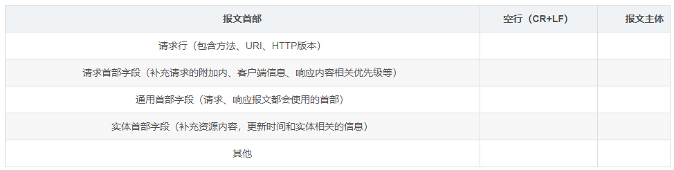
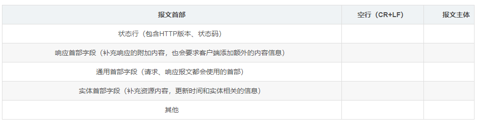

# HTTP

HTTP 是基于TCP 实现的应用层协议,用于互联网内容传输.分为请求和响应两个部分.主要版本有 HTTP1.1(上一代主要版本)与HTTP2.0(当前版本,于2015年5月作为互联网标准正式发布)

## 报文结构

HTTP Request

HTTP Response

## Method

* GET : 向指定的资源发出“显示”请求.使用GET方法应该只用在读取数据,而不应当被用于产生“副作用”的操作中,例如在Web Application中.其中一个原因是GET可能会被网络蜘蛛等随意访问.参见安全方法
* HEAD : 与GET方法一样,都是向服务器发出指定资源的请求.只不过服务器将不传回资源的本文部分.它的好处在于,使用这个方法可以在不必传输全部内容的情况下,就可以获取其中“关于该资源的信息”(元信息或称元数据).
* POST : 向指定资源提交数据,请求服务器进行处理(例如提交表单或者上传文件).数据被包含在请求本文中.这个请求可能会创建新的资源或修改现有资源,或二者皆有.
* PUT : 向指定资源位置上传其最新内容.
* DELETE : 请求服务器删除Request-URI所标识的资源.
* TRACE : 回显服务器收到的请求,主要用于测试或诊断.
* OPTIONS :这个方法可使服务器传回该资源所支持的所有HTTP请求方法.用'*'来代替资源名称,向Web服务器发送OPTIONS请求,可以测试服务器功能是否正常运作.
* CONNECT : HTTP/1.1协议中预留给能够将连接改为管道方式的代理服务器.通常用于SSL加密服务器的链接(经由非加密的HTTP代理服务器).

方法名称是区分大小写的.当某个请求所针对的资源不支持对应的请求方法的时候,服务器应当返回状态码405(Method Not Allowed),当服务器不认识或者不支持对应的请求方法的时候,应当返回状态码501(Not Implemented).
HTTP服务器至少应该实现GET和HEAD方法,其他方法都是可选的.当然,所有的方法支持的实现都应当匹配下述的方法各自的语义定义.此外,除了上述方法,特定的HTTP服务器还能够扩展自定义的方法.例如：

* PATCH(由 RFC 5789): 用于将局部修改应用到资源.

## Header

* 通用头字段(英语：General Header Fields)
* 请求头字段(英语：Request Header Fields)
* 响应头字段(英语：Response Header Fields)
* 实体头字段(英语：Entity Header Fields)

具体内容可以查看[Wiki 定义](https://zh.wikipedia.org/wiki/HTTP%E5%A4%B4%E5%AD%97%E6%AE%B5)

## 状态码

* 1xx消息 : 请求已被服务器接收，继续处理
* 2xx成功 : 请求已成功被服务器接收,理解,并接受
* 3xx重定向 : 需要后续操作才能完成这一请求
* 4xx请求错误 : 请求含有词法错误或者无法被执行
* 5xx服务器错误 : 服务器在处理某个正确请求时发生错误

## Keep-Alive

HTTP早期版本中,每次请求和响应都重新穿点TCP连接,考虑到频繁请求的场景,HTTP1.0增加 `Keep-Alive`功能,使用同一个TCP连接来发送和接收多个HTTP请求/应答，而不是为每一个新的请求/应答打开新的连接

## HTTPS

在HTTP下层增加了 SSL/TLS,相当于对HTTP进行了安全封装.